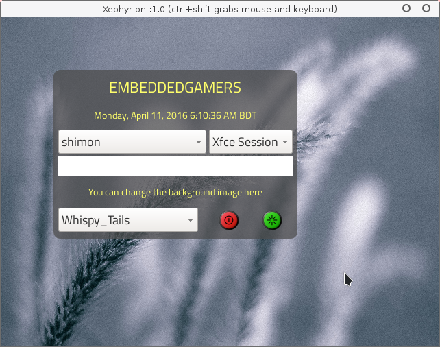
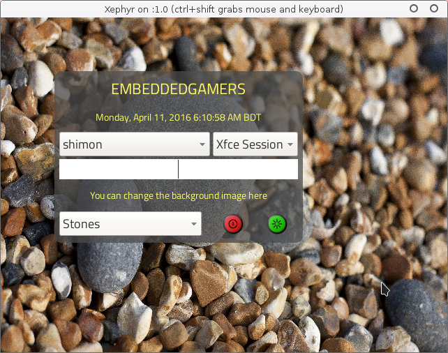

# lightdm-qt5-swallowed
Qt5 greeter for LightDM. This project is greatly inspired by 2 other greeter projects - 

* [qt-lightdm-greeter](https://github.com/surlykke/qt-lightdm-greeter) and
* [lightdm-webkit-theme-antergos](https://github.com/Antergos/lightdm-webkit-theme-antergos)

Here are some screenshots from lightdm debug mode -




## Compiling and installing
You will need Qt5 libraries and build tools to build this greeter. Along with it you will need ```liblightdm-qt5``` package. Install them and clone this repository. Then run the following commands inside the cloned folder -
```
qmake 
make release
sudo make install
```
After this you have to edit ```/etc/lightdm/lightdm.conf``` file and set ```greeter-session``` to ```lightdm-qt5-swallowed```.

## Configurations 
At this point things get a little weird. I could not manage to modify the default ```/etc/lightdm/lightdm-qt5-swallowed.conf``` file from the greeter, so it uses a file under ```/tmp``` to save the configurations. You can modify ```/tmp/lightdm-qt5-swallowed.conf``` to meet your choice. The following options can be used there -

* imageDir - you can specify any directory where you have put your background images. Images can be put in subdirectories. The greeter enlist them all for you. Currently ```.jpg .jpeg``` and ```.png``` files will be enlisted.
* imageBaseName - the base file name of the selected background image.
* imageAbsoluteFilePath - the absolute path of the selected background image.
* xOffset - offset to x axis in pixels from top left corner of the screen for the login form.
* yOffset - offset to y axis in pixels from top left corner of the screen for the login form.
* lastUser - last user logged in.
* username_lastSession - last session the user of username logged in.

